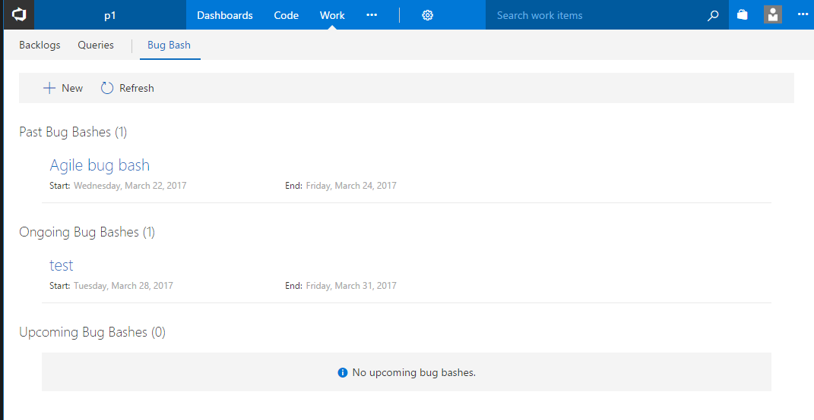
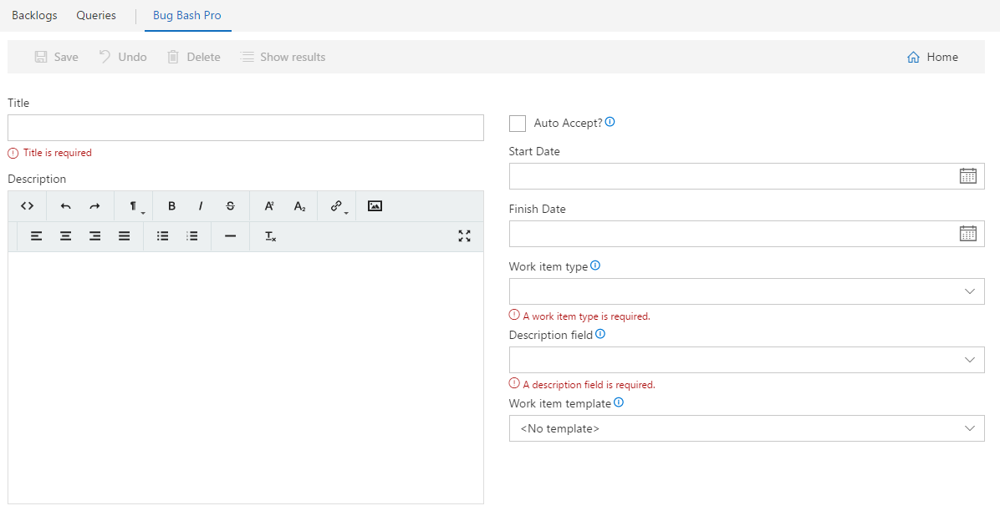
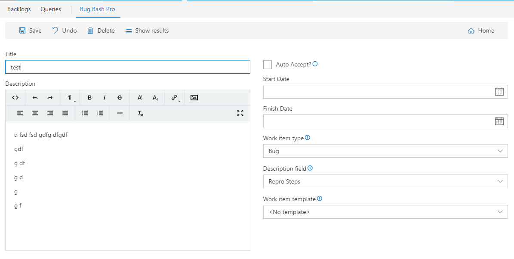
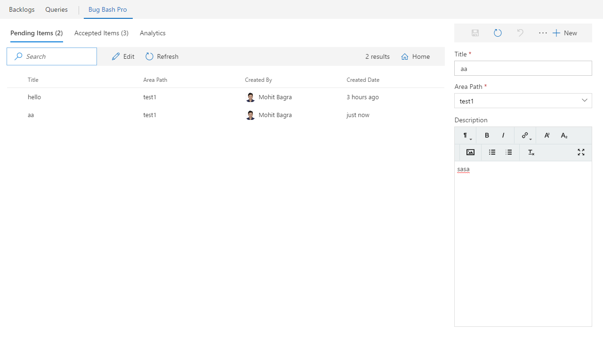

# Bug Bash Pro

# Manage team wide bug bashes
A work hub extension that lets teams manage their bug bashes in a more efficient manner. When a new feature is being tested either org wide or team wide, a lots of bugs are created and its hard to track all the bugs created in one instance of testing. Users can use features like work item templates to use pre-defined set of field values while creating bugs and then track them using work item queries, but its a tedious process in 2 ways - 

1. A work item form needs to be opened each time to create a workitem.
2. To track all workitems in the bug bash, you need to navigate to the query view which makes you lose work item form view.

Some teams use tools like OneNote or other note syncing apps where users can track all the workitems and add new workitems in the same page, but then someone has to manually create VSTS workitems from that note.

This extension tries to simplify this in 2 ways -

1. View all the workitems created in a bug bash instance while creating a new workitem.
2. Quickly create new items, accept them if they are valid bugs and get a quick report on how many bugs were created per area path and who filed most number of bugs and deserves a prize :).

#### Overview ####
The home page of the extension shows all the past/ongoing/upcoming bug bash instances. 

To create a new bug bash instance, click "New", which opens the bug bash editor

You can enter bug bash information in the editor to create it. Here are the properties of a bug bash instances -

1. **Title** *(required)* - The title of the bug bash instance
2. **Description** - A short description about the bug bash. It can describe what the bug bash is for. What features need to be tested etc.
3. **Start Date** - A start date for the bug bash. This is not a required field. An empty start date means the bug bash is ongoing until it ends.
4. **Finish Date** - An end date for the bug bash. This is not a required field. An empty end date means the bug bash never ends.
5. **Work item type** *(required)* - Describes which type of workitem this bug bash instance associates with. 
6. **Description Field** *(required)* - Describes which HTML field does the item description bounds to when you accept an item to create VSTS work item.
7. **Work item template** - You can choose a work item template that would be used to autofill certain field values for each new workitem created in this bug bash instance. A work item template can be created from VSTS team admin view. Note that work item templates are team scoped, so in this dropdown, you can only choose templates which are in the scope of the current team.
8. **Auto Accept** - Whether the item would be auto accepted as soon as its created. By accept, it means that a VSTS work item is created for the bug bash item.

*P.S.* : Work item templates are defined per team per workitem type. So the templates in the dropdowns would be scoped to the current team and the workitem type selected from WorkItemType dropdown. Since the templates are team scoped, each bug bash instance is also scoped to a team. So the bug bash instance created in the context of team "t1" would not show up in the bug bash view in team "t2".

Once saved, click on "Show Results" to go to the results view of this bug bash instance.

In the results page, you can see 3 tabs at the top -
1. **Pending items** - It shows all the items which are not yet accepted. By accepted, I mean that no VSTS work items have been created for these items. When you create any new item (if the Auto accept is turned off in the bug bash instance), it just creates a bug bash item without creating any work item for it. Only when you accept it, it will create an actual VSTS work item based on the work item template selected during the bug bash creation. Each item can be edited in this list by double clicking the row or clicking the title.
2. **Accepted items** - It shows all the items which have been accepted. Since accepted items are in fact real VSTS work items, to edit them, you need to open the work item. This list shows a work item grid and to open a work item you can double click the row or click the title. Accepting an item is an irreversible step. You can choose to unlink an accepted work item from this bug bash instance by clicking on "Remove" menu item from each row's context menu.
3. **Analytics** - This tab shows 2 charts for the bug bash instance. The first is number of items created per user and 2nd is number of items created per area path. These charts include both pending and accepted items.

To create or edit any pending item, you can use the item editor at the right side of the results page. Note that if the "New" button in this editor is disabled, that means this editor will create a new item. If the new item is enabled, that means that this editor is showing an already existing item. 
When a new item is created, it will store the title, description and area path into the item's data. When the item is accepted, the title and area path from the item would be used to fill the title and area path of accepted work item. And the description would be filled in the description field selected during bug bash creation.

*P.S* - Each item row in the results view also has a context menu. So users can right click on a row (or on multiple selected rows) to open the context menu.
